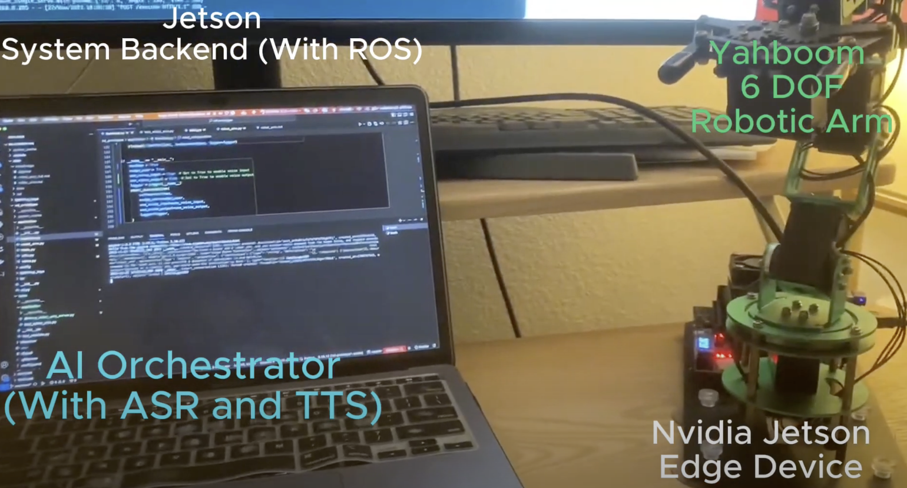
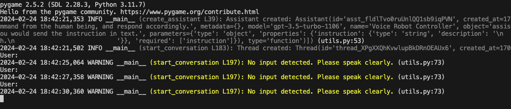

# mnlm
机器人臂演示的源代码（参见 https://www.bilibili.com/video/BV1ub4y1T7Jt/）。

[](https://www.bilibili.com/video/BV1ub4y1T7Jt/?vd_source=08295b5b4b3c5ece73fb91e3a54d202a)

## 构建并启动Docker容器
0. 将 .env.template 更名为 .env 并添加 OPEN_API_KEY。
1. 安装 [Docker](https://docs.docker.com/get-docker/) 和 [Docker Compose](https://docs.docker.com/compose/install/)。
```bash
docker-compose up --build -d
```

此命令将为服务器端构建docker镜像，并启动docker容器。
用户也可以通过浏览器访问 http://localhost:8080/vnc.html 来访问模拟环境。

[]

2. 登录到docker容器。
如果您使用vscode，您可以安装 Dev Container 扩展并打开正在运行的容器。否则，您可以通过运行以下命令登录到docker容器：
```
docker exec -it mnln-ros_dev_env-1 /bin/bash
```

3. 启动ROS2模拟。

```bash
cd /home/small-thinking/mnlm/mnlm/robot/robot_arm_ws
```

```
colcon build --symlink-install ; source install/setup.bash ; ros2 launch robot_arm robot_arm.launch.py
```

您应该会看到服务器端程序启动。并且您可以访问 http://localhost:8080/vnc.html 来看到Gazebo Fortress模拟环境。


4. 在您的宿主机上。您可以运行命令以启动基于声音的UI。

进入项目文件夹：
```bash
cd mnlm/client/gpt_control
```

```bash
python assistant.py
```
然后您可以看到客户端启动，并且您将被提示告诉机器人要做什么。




