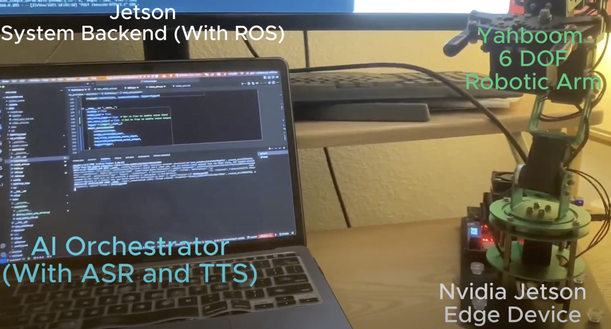
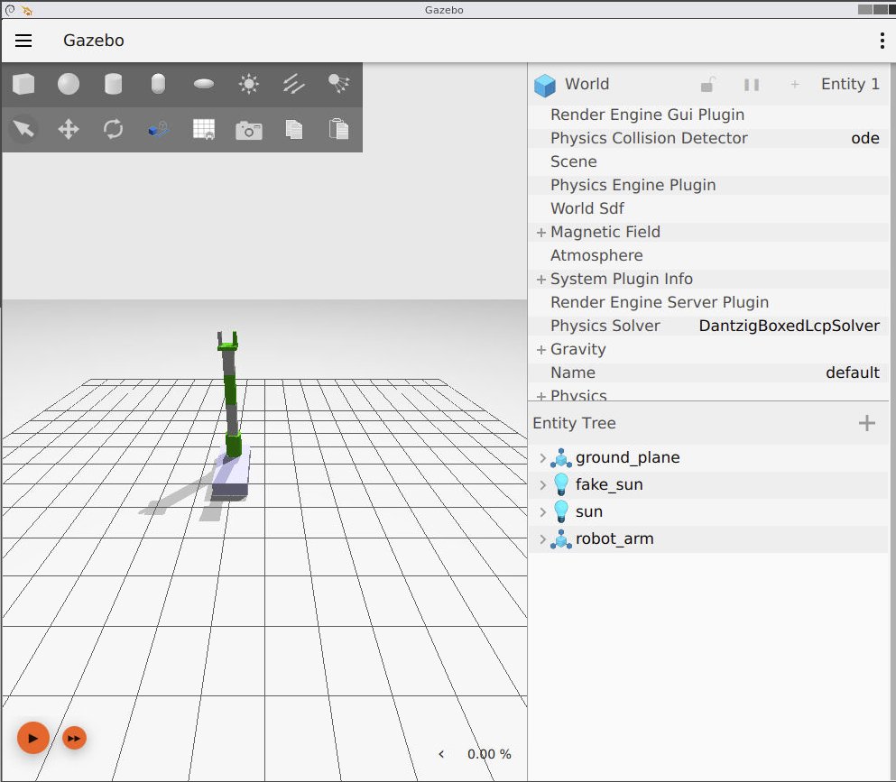
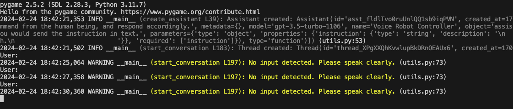

# mnlm ([中文文档](README.cn.md))

Source code of robotic arm demo (see https://www.bilibili.com/video/BV1ub4y1T7Jt/).


[](https://www.bilibili.com/video/BV1ub4y1T7Jt/?vd_source=08295b5b4b3c5ece73fb91e3a54d202a)

## Build and Start the Docker Container

1. Install [Docker](https://docs.docker.com/get-docker/) and [Docker Compose](https://docs.docker.com/compose/install/).
```bash
docker-compose up --build -d
```

This command will build the docker image for the server side, and also start the docker container.
Users can also access the simulation environment through the browser by visiting `http://localhost:8080/vnc.html`.
[]

2. Login to the docker container.
If you use vscode, you can install the `Dev Container` extension and open the running container. Otherwise, you can login to the docker container by running the following command:
```bash
docker exec -it mnln-ros_dev_env-1 /bin/bash
```

3. Start the ROS2 simulation.
```bash
cd /home/small-thinking/mnlm/mnlm/robot/robot_arm_ws
```

```
colcon build --symlink-install ; source install/setup.bash ; ros2 launch robot_arm robot_arm_sim.launch.py
```

You should see the server side program started. And you can visit `http://localhost:8080/vnc.html`` to see the Gazebo Fortress simulation environment.



4. In your host machine. You can run the command to start the voice based UI.



```bash

In the project folder:
```bash
cd mnlm/client/gpt_control
```
Then you can see the client side started, and you will be prompoted to tell the robot what to do.

```bash
python assistant.py
```
