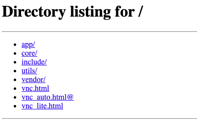
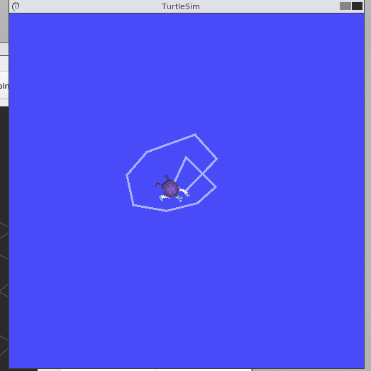

# mnlm
Source code of robotic arm demo (see https://www.bilibili.com/video/BV1ub4y1T7Jt/).

TODOs:
1. Restructure the data format of the robot arm servo control.


[](https://www.bilibili.com/video/BV1ub4y1T7Jt/?vd_source=08295b5b4b3c5ece73fb91e3a54d202a)

## Build
```bash
docker build -t mnlm .
```

## Development
You can run the docker on the background and login to the docker container to do the development.

0. Install the [Remote - Containers](https://marketplace.visualstudio.com/items?itemName=ms-vscode-remote.remote-containers) extension in VSCode.
1. Start the docker container:
```bash
docker-compose up -d
```
2. In VSCode, click the "Open the remote window" button on the bottom left corner, and select "Remote-Containers: Attach to Running Container..."
3. Select the container you just started, should be something like `mnln-ros_dev_env-1`. And you will see a new VSCode window pop up.
4. Open the folder `/home/small-thinking/mnlm` in the new VSCode window, and you can start the development.

### Start rviz2
rviz2 is a visualization tool for ROS2. You can use it to visualize the robots.
Open a terminal in the docker container, and run the following command:
```bash
root@809c4c72ba40:~# ros2 run rviz2 rviz2

QStandardPaths: XDG_RUNTIME_DIR not set, defaulting to '/tmp/runtime-root'
[INFO] [1703722219.404846429] [rviz2]: Stereo is NOT SUPPORTED
[INFO] [1703722219.404925804] [rviz2]: OpenGl version: 4.5 (GLSL 4.5)
[INFO] [1703722219.659990970] [rviz2]: Stereo is NOT SUPPORTED
```
Then in your host machine, open a browser and go to `http://localhost:8080/`. You will see the rviz2 file list. 



Click vnc.html, and then click the "Connect" button. You will see the rviz2 UI.

### Start RQt
RQt is a graphical user interface framework that implements various tools and interfaces in the form of plugins. One can run all the existing GUI tools as dockable windows within RQt.

Open a new terminal in the docker container, and run the following command:
```bash
root@809c4c72ba40:~/mnlm# rqt

QStandardPaths: XDG_RUNTIME_DIR not set, defaulting to '/tmp/runtime-root'
```
You will see the RQt added to the rviz2 UI.

### Test with sample programs

#### Test with demo_nodes_cpp
Run the demo_node_cpp talker:
```bash
source /opt/ros/humble/setup.bash
ros2 run demo_nodes_cpp talker
```

In another terminal, run the demo_node_py listener:
```bash
source /opt/ros/humble/setup.bash
ros2 run demo_nodes_py listener
```
#### Test with turtlesim
Run turtlesim_node:
```bash
root@809c4c72ba40:~/mnlm# ros2 run turtlesim turtlesim_node
QStandardPaths: XDG_RUNTIME_DIR not set, defaulting to '/tmp/runtime-root'
[INFO] [1703722372.104943222] [turtlesim]: Starting turtlesim with node name /turtlesim
[INFO] [1703722372.108501763] [turtlesim]: Spawning turtle [turtle1] at x=[5.544445], y=[5.544445], theta=[0.000000]
```

In another terminal, run turtle_teleop_key:
```bash
root@809c4c72ba40:~/mnlm# ros2 run turtlesim turtle_teleop_key

Reading from keyboard
---------------------------
Use arrow keys to move the turtle.
Use G|B|V|C|D|E|R|T keys to rotate to absolute orientations. 'F' to cancel a rotation.
'Q' to quit.
```



## Cleanup untagged images
```bash
docker rm $(docker ps -a -q) ; docker images | grep '<none>' | awk '{print $3}' | xargs docker rmi
```


TODOs:
5. Build a key value store to store the verbal command and the list of commands.
6. Index the key value store with the verbal command in to vector db.
7. Add RAG after voice recognition.